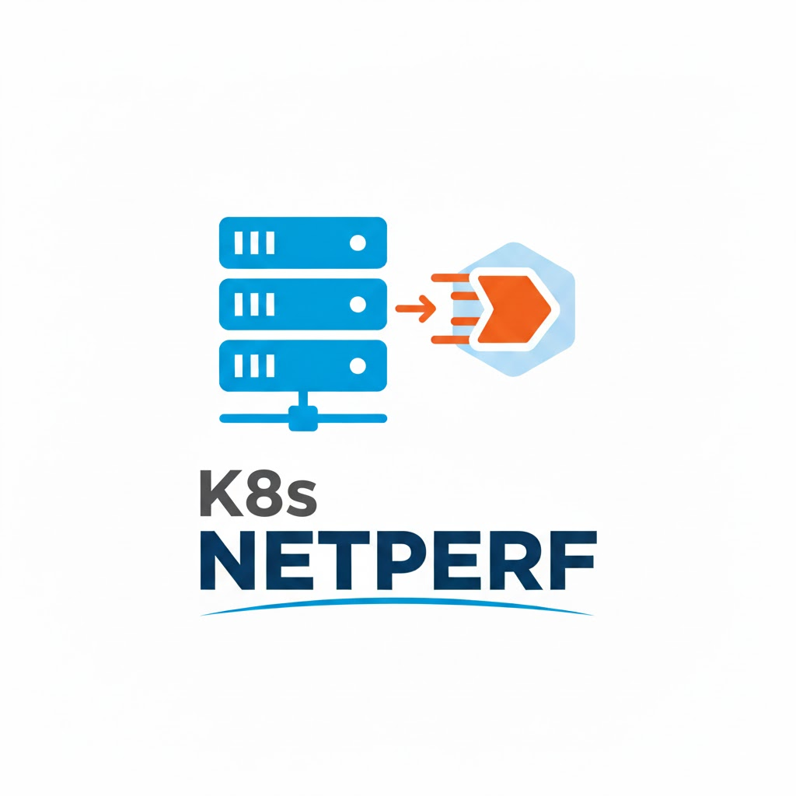

<p align="center">
    
</p>

# k8s-netperf - Kubernetes Network Performance

A tool to run network performance tests in Kubernetes clusters.

## Overview

`k8s-netperf` is a comprehensive network performance testing tool designed specifically for Kubernetes environments. It supports multiple benchmark tools (netperf, iperf3, uperf and ib_write_bw) and can test various network scenarios including pod-to-pod, host networking, and cross-availability zone communications.

### Supported Benchmarks

| Tool        | Test       | Status  |
| ----------- | ---------- | ------- |
| netperf     | TCP_STREAM | Working |
| netperf     | UDP_STREAM | Working |
| netperf     | TCP_RR     | Working |
| netperf     | UDP_RR     | Working |
| netperf     | TCP_CRR    | Working |
| uperf       | TCP_STREAM | Working |
| uperf       | UDP_STREAM | Working |
| uperf       | TCP_RR     | Working |
| uperf       | UDP_RR     | Working |
| iperf3      | TCP_STREAM | Working |
| iperf3      | UDP_STREAM | Working |
| ib_write_bw | UDP_STREAM | Working |

## Quick Start

Install latest stable version with:

```shell
curl -Ls https://raw.githubusercontent.com/cloud-bulldozer/k8s-netperf/refs/heads/main/hack/install.sh | sh
```

> [!NOTE]
> Default installation path is `${HOME}/.local/bin/`, you can change it by setting the `INSTALL_DIR` environment variable to the desired path.
> before running the script

Then create the required resources:
```shell
$ kubectl create ns netperf
$ kubectl create sa netperf -n netperf
$ k8s-netperf --config netperf.yml
```

## Documentation

For detailed documentation, please refer to the following guides:

- **[Setup and Installation](docs/setup.md)** - How to build, install, and configure k8s-netperf
- **[Configuration](docs/configuration.md)** - Configuration file formats, benchmark options, and OpenSearch integration
- **[Advanced Usage](docs/advanced-usage.md)** - VMs, User Defined Networks (UDN), bridge networks, and external servers
- **[Output and Results](docs/output-and-results.md)** - Understanding test output, pass/fail criteria, and CSV exports

## Features

- **Multiple benchmark tools**: Support for netperf, iperf3, uperf and ib_write_bw
- **Flexible test scenarios**: Pod-to-pod, host networking, cross-AZ testing
- **Virtual Machine support**: Test with KubeVirt VMs
- **Advanced networking**: User Defined Networks (UDN) and bridge interfaces
- **Pass/fail validation**: Automated performance regression detection
- **Result archiving**: CSV export and OpenSearch integration
- **Prometheus integration**: System metrics collection during tests

## Contributing

Please see [CONTRIBUTING.md](CONTRIBUTING.md) for guidelines on how to contribute to this project.
